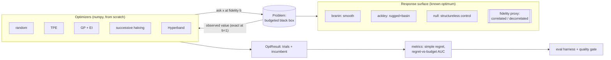

# TuneForge

[](https://tuneforge.dexdevs.com)

> **▶ Live demo: [tuneforge.dexdevs.com](https://tuneforge.dexdevs.com)** — run it in your browser, free offline backend. Browse all 10 portfolio demos via the *all demos* link.

[](https://github.com/ranafaraz/TuneForge/actions/workflows/ci.yml)
[](https://www.python.org/)
[](LICENSE)

**A from-scratch benchmark of black-box hyperparameter optimizers against *known*
optima — built to answer not just "which optimizer wins" but *why*.**

Two kinds of optimizer are famous for beating random search, for two different
reasons. TuneForge isolates each reason and proves it with an ablation that makes the
advantage disappear:

- **Model-based search (TPE, GP-EI) buys *sample-efficiency* from response-surface
  structure.** Remove the structure and the advantage collapses to random.
- **Multi-fidelity search (successive halving, Hyperband) buys *budget-efficiency*
  from fidelity-rank correlation** — cheap, low-budget looks that rank configs the
  way the expensive ones do. Decorrelate the cheap proxy and the advantage collapses.

Every optimizer and every response surface is implemented on **numpy alone**. There
are no API keys, no model downloads, and no training data: the objective is an
analytic function whose global minimum is known in closed form, so "how good is this
optimizer" has an exact, reproducible answer. CI runs the whole benchmark offline.

## Demo

```console
$ tuneforge compare --surface branin --budget 60 --seed 0
surface branin  optimum=0.397887  budget=60  seed=0  regime=correlated
optimizer            family             regret        auc    spent
------------------------------------------------------------------
random               baseline           0.1342     3.3577     60.0
tpe                  model-based        0.0264     2.7450     60.0
gp_ei                model-based        0.0958     3.6407     60.0
successive_halving   multi-fidelity     0.7831     2.1036     60.0
hyperband            multi-fidelity     0.1416     1.6823     59.7
```

<!-- A recorded run lives at docs/demo.gif (placeholder for now). -->


## Architecture



A **`Problem`** is the single budgeted black box every optimizer talks to: it charges
budget equal to the fidelity spent and returns the (exact at `b = 1`, biased below)
observation. Regret is read only off full-fidelity evaluations, so single-fidelity and
multi-fidelity methods compete on one honest axis — *budget spent*.

## The result

**16 seeds · budget 60 · scored against the analytic optimum · no keys, no downloads.**

### Effect 1 — sample-efficiency, and its ablation

| surface | structure | random | TPE | GP-EI | TPE adv | GP-EI adv |
|---|---|--:|--:|--:|--:|--:|
| branin | smooth | 0.8729 | 0.2096 | 0.0539 | **4.16×** | **16.20×** |
| ackley | rugged+basin | 2.8661 | 1.6329 | 1.3227 | 1.76× | 2.17× |
| null | **none (control)** | 0.0155 | 0.0320 | 0.0139 | 0.48× | 1.11× |

*Advantage = mean simple regret of random ÷ optimizer.* Model-based search turns
structure into a big win on branin/ackley; on the structureless null surface — same
optimizers, same budget, structure removed — the advantage collapses to ~1×.

### Effect 2 — budget-efficiency, and its ablation

| surface | fidelity proxy | random | succ. halving | Hyperband | SH adv | HB adv |
|---|---|--:|--:|--:|--:|--:|
| branin | rank-correlated | 3.247 | 1.918 | 2.460 | **1.69×** | **1.32×** |
| branin | **decorrelated (ablation)** | 3.247 | 5.611 | 5.094 | 0.58× | 0.64× |
| ackley | rank-correlated | 4.265 | 3.690 | 3.761 | 1.16× | 1.13× |
| ackley | **decorrelated (ablation)** | 4.265 | 4.780 | 4.425 | 0.89× | 0.96× |

*Advantage = mean regret-vs-budget AUC of random ÷ optimizer.* With a rank-correlated
cheap proxy, screening at low fidelity pays — the multi-fidelity methods beat random per
unit budget. Decorrelate the proxy and the early eliminations become coin flips, so they
spend budget to do *worse* than random.

The two effects are independent: the structure ablation leaves multi-fidelity untouched,
and the fidelity-correlation ablation leaves sample-efficiency untouched. Full numbers in
[`evals/RESULTS.md`](evals/RESULTS.md); the [quality gate](evals/gate.py) asserts the
*shape* (wins where expected, collapses where expected) and fails CI otherwise.

## Install & run

```bash
pip install -e ".[dev]"      # numpy only; offline

tuneforge surfaces                                   # list surfaces + their optima
tuneforge compare --surface branin --budget 60       # all optimizers, one surface
tuneforge optimize --optimizer hyperband --surface ackley --fidelity decorrelated
python -m evals.harness                               # full benchmark -> evals/RESULTS.md
python -m evals.gate                                  # assert the dissociation holds

pytest -q && ruff check .                             # 56 tests, lint
```

Docker:

```bash
docker build -t tuneforge . && docker run --rm tuneforge   # runs the offline benchmark
```

### Configuration

Everything is offline by default. Override via env vars or `.env` (see
[`.env.example`](.env.example)): `TUNEFORGE_OPTIMIZER`, `TUNEFORGE_SURFACE`,
`TUNEFORGE_FIDELITY`, `TUNEFORGE_BUDGET`, `TUNEFORGE_SEED`.

**Optional cross-check.** `pip install ".[optuna]"` then `TUNEFORGE_BACKEND=optuna`
re-runs `random` / `tpe` with Optuna's own samplers on the same surfaces, confirming the
headline ranking with an independent, battle-tested implementation.

## How it works

- **Surfaces** ([`tuneforge/surfaces/`](tuneforge/surfaces)) — Branin and Ackley have
  closed-form global minima; `null` is a grid of independent pseudo-random cells (no
  gradient, no basin) and serves as the structure-removed control. The fidelity model
  adds a small smooth bias (`correlated`) or a large rough bias (`decorrelated`) at
  `b < 1`, but is **exact at `b = 1`** so the regime can only change the search *path*,
  never the final score.
- **Optimizers** ([`tuneforge/optimizers/`](tuneforge/optimizers)) — `random`; `tpe`
  (Parzen densities with adaptive per-point bandwidths, proposing by `l(x)/g(x)`);
  `gp_ei` (RBF-kernel Gaussian process + Expected Improvement, Cholesky-solved in numpy);
  `successive_halving` and `hyperband` (η = 3 brackets over fidelities 1/9 → 1/3 → 1).
- **Metrics** ([`tuneforge/metrics.py`](tuneforge/metrics.py)) — simple regret and the
  budget-normalized area under the regret-vs-budget curve (anytime performance).

See [`docs/ARCHITECTURE.md`](docs/ARCHITECTURE.md) and
[`docs/DECISIONS.md`](docs/DECISIONS.md) for the design and the trade-offs behind it.

## License

MIT — see [LICENSE](LICENSE).
